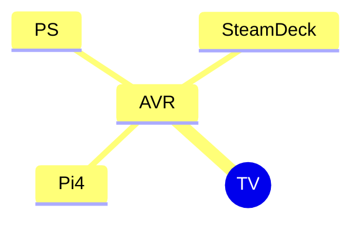

This was a simple program to switch a USB power socket according to my TVs status running on a Pi4.

As all software it became more complex over time:
 1. Added System Audio Mode to play music from my Pi while the TV is off by monitoring pulse for playback
 2. Added a "remote" to control AVR volume
 3. Upgraded Raspbian from Bullseye to Bookworm and had to cope with the new HDMI driver
    - switched playback monitoring from pulse to pipewire, then to MitM [snapclient](https://github.com/badaix/snapcast)
    - ALSA and/or pipewire can't connect to HDMI if the AVR is off (for a longer duration?)
    - Some CEC messages where no longer passed through if not in monitor mode
    - If started with TV off, it assumes the wrong physical address
 4. "remote" gained can now also switch the power socket and change the active source
 5. replay active source for the AVR if it missed it (because it had no power)

Some things are actually hardcoded to my setup:
 - physical address of my pi: `3.3.0.0`
 - arguments to [snapclient](https://github.com/badaix/snapcast)

# Setup

## HDMI

AVR: AVR-X540BT
TV: Sony

## Pi

- USB power socket
- snapclient is the only thing playing music
- default systemd service of snapclient is disabled

